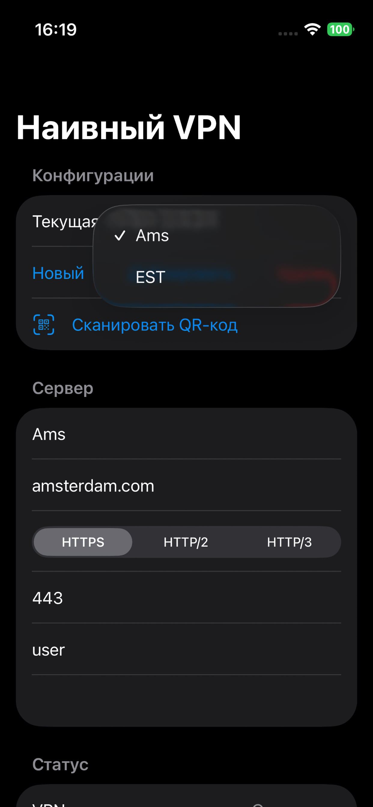
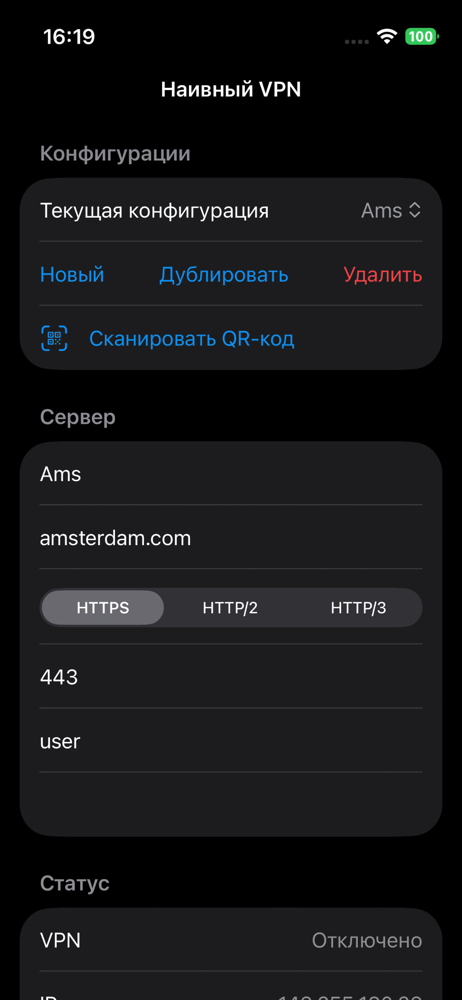
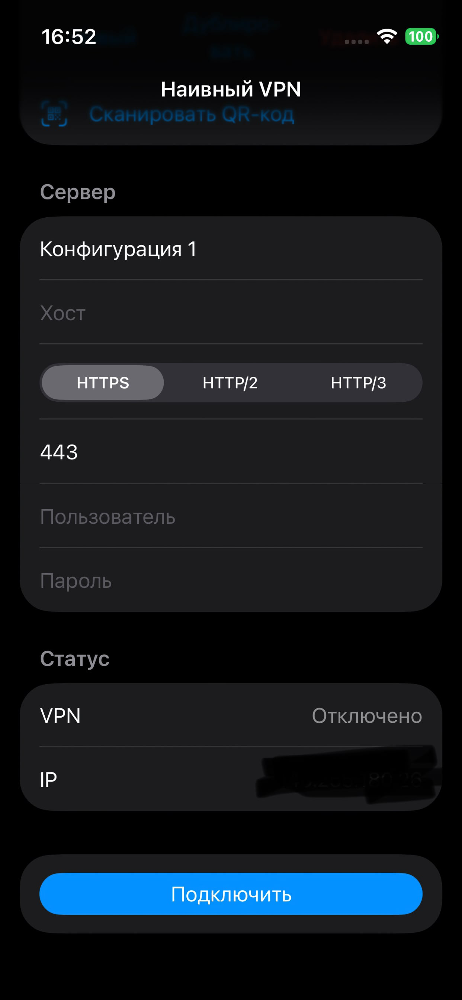
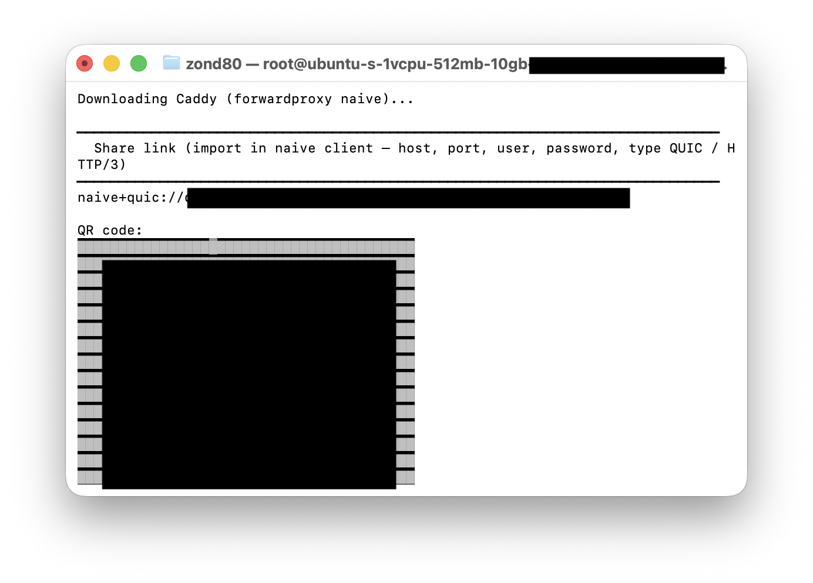

<p align="center">
    
</p>

# All-In-One Naive VPN

[Russian version](README_ru.md)

A monorepo with an **iOS and MacOS client** for NaiveProxy (Packet Tunnel + sing-box `Libbox`) and a **run-and-forget server script** using Caddy with the forwardproxy (naive) plugin.

<p align="center">
  <a href="https://appdb.to/details/8ca8a41db219d2c36acca881628efb1d26e32115">
    
  </a>
</p>

Apple's App Store publication is pending.

## Screenshots

<p align="center">
  
  
  
</p>

### Server configuration

<p align="center">
  
</p>

## Layout

| Directory | Purpose                                                                           |
| --------- | --------------------------------------------------------------------------------- |
| `app/`    | `NaiveVPN` iOS app, tunnel extension, shared configuration code                   |
| `misc/`   | Split archive of `Libbox.xcframework` (restore into `app/` — see below)           |
| `server/` | `start_server.sh` — install and run Caddy (naive forward proxy) on a Linux server |

## iOS app (`app/`)

1. Obtain `Libbox.xcframework` under `app/` — **either** build from source **or** restore from the archive in `misc/` (the framework is not kept in git due to GitHub limits):

Build:

```bash
cd app
./Scripts/build_libbox.sh
```

Restore from `misc/` (parts `Libbox.xcframework.zip.aa`, `.ab`, … are concatenated into one zip, then unpacked into `app/`):

```bash
# from the repository root
cat misc/Libbox.xcframework.zip.* > /tmp/Libbox.xcframework.zip
unzip -o /tmp/Libbox.xcframework.zip -d app
rm /tmp/Libbox.xcframework.zip
```

Make it compatible with iOS builds:

```bash
./app/Scripts/libbox_flatten_framework.sh
```

2. Open `NaiveVPN.xcodeproj` in Xcode.

3. Configure code signing.

4. Build and run on a **physical device** (Packet Tunnel does not work in the simulator).


## Server (`server/start_server.sh`)

The script targets **Linux** and must be run **as root** (`sudo`). It:

- checks that the domain resolves to the machine’s public IP;
- on first run, asks for the domain, Let’s Encrypt email, proxy login and password, and writes `/etc/caddy/Caddyfile`;
- downloads a static `index.html` (thanks, Igor Sysoev!) and a **Caddy binary with forwardproxy (naive)** (the version I tested — and it works);
- prints a share link and, if utilities are available, a QR code for import into a naive client;
- runs Caddy in the foreground (`exec`).

Requirements: `python3`, `tar`, and for downloads `curl` or `wget`; for DNS checks `dig`, `getent`, or `host`.

### Download the script with `wget` and run in `screen`

Direct **raw** link (branch `main`):

```text
https://raw.githubusercontent.com/ZonD80/naivetools/main/server/start_server.sh
```

Example:

```bash
mkdir -p ~/naive-server && cd ~/naive-server
wget -O start_server.sh "https://raw.githubusercontent.com/ZonD80/naivetools/main/server/start_server.sh"
chmod +x start_server.sh
```

`screen` session so the process survives SSH disconnect:

```bash
screen -S naive-caddy
sudo ./start_server.sh
```

Detach from `screen` while leaving Caddy running: **Ctrl+A**, then **D**. Reattach: `screen -r naive-caddy`.

Before the first run, point the domain’s **DNS A record** at this server’s IP — the script verifies this.

### If the repository is already cloned

```bash
cd naivetools/server
chmod +x start_server.sh
screen -S naive-caddy
sudo ./start_server.sh
```

The `naivetools` directory is the repository after `git clone https://github.com/ZonD80/naivetools.git`.

On subsequent runs, if `/etc/caddy/Caddyfile` already exists, interactive prompts for domain and credentials are skipped — the existing configuration is used.

## Acknowledgements

- [NaiveProxy](https://github.com/klzgrad/naiveproxy) — original implementation.
- [sing-box](https://github.com/SagerNet/sing-box) — **Libbox** (Packet Tunnel / gomobile build for iOS).
- [forwardproxy](https://github.com/klzgrad/forwardproxy) (naive) — server side.
- [nginx](https://github.com/nginx/nginx) — excellent web server and typical default page; nginx serves roughly 70% of sites on the web (by share among web servers).

**Android:** you can use the [Exclave](https://github.com/dyhkwong/Exclave) client and the separate upstream **Naive Proxy Plugin** release (see the Download section in the Exclave repo).

## Support

If this project helped you, you can buy the author a coffee on [Buy Me a Coffee](https://buymeacoffee.com/zond80).
